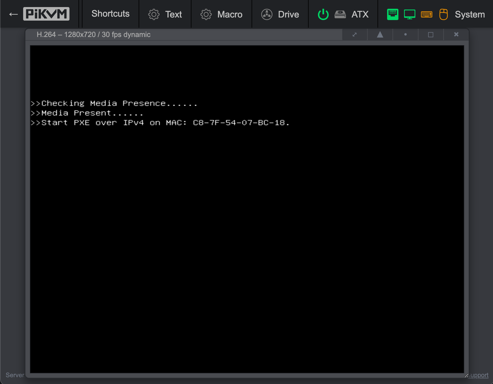
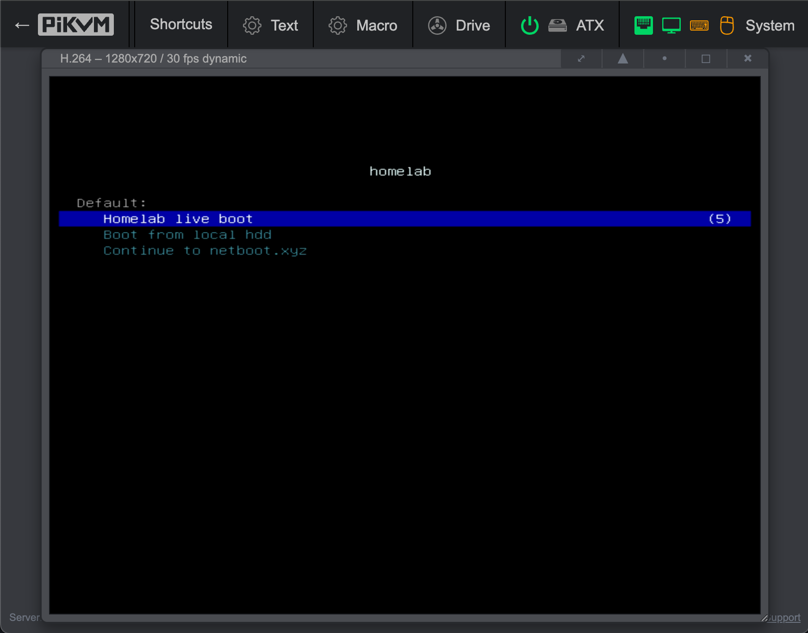
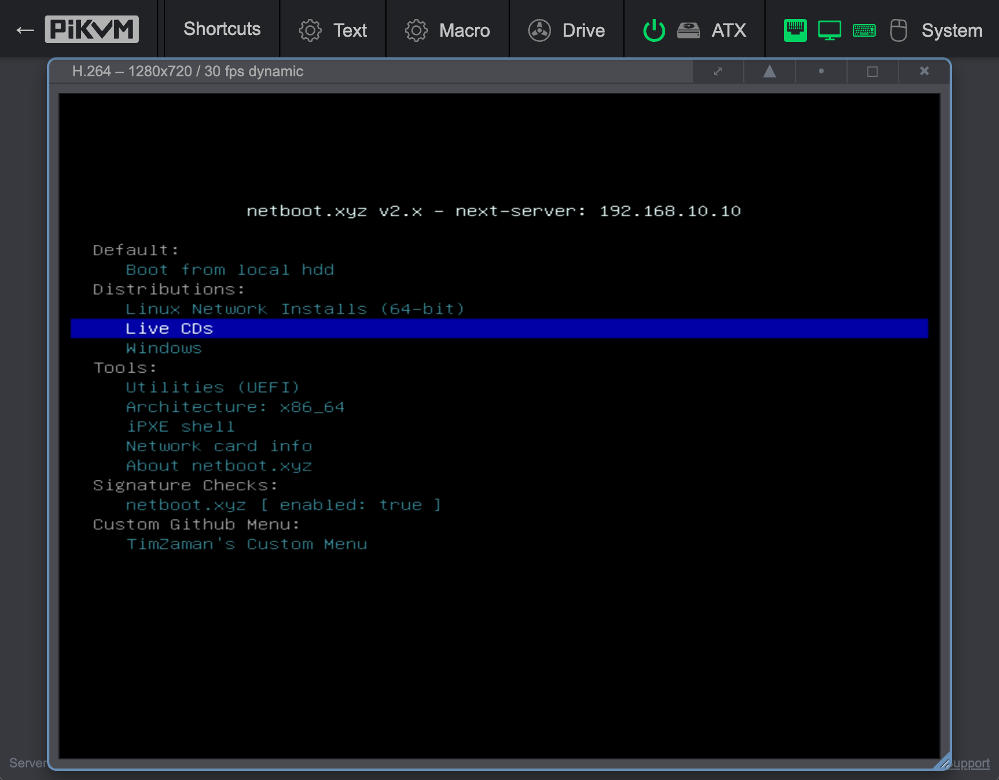
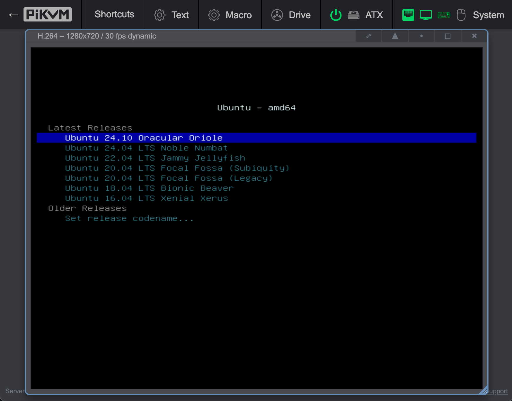

# Homelab Provisioning

*2025 March*<br />

-----

After 30 years of systems administration (95% of which was amateur-hour), I've grown to keep my setups stateless, simple and minimal - without fancy sw or configs.

But if you have a large homelab, or if you're doing open heart surgey on your sw stack (kernel, drivers, booting, configs), the iteration speed of re-imaging your servers gets really old.

In the bay area, I often buy up used engineering samples of the latest CPUs, GPUs, NICs and SSDs. It's often unclear how to get them to work - but I have been quite succesful just swinging at it with different OS/kernels/kernel modules/drivers/etc, and then with their specific magic incantations.

Iteration speed is the high order bit in getting things done, and I'm pleased with the below setup. 

## Overview

A simple network boot setup that:

1. By default boots into a (zero-install) diskless (ramdisk) live Ubuntu 22.04 image, with hostname set and obtained through DHCP, and `/home` mounted through NFS.
2. Optionally boots into nearly *any* supported distribution (centos, debian, ubuntu, windows, etc) either for installation or into an official "live image".

<figure>
  
  <figcaption>Initial boot splash</figcaption>
</figure>

<figure>
  
  <figcaption>Custom menu that network-boots my default image in 5s</figcaption>
</figure>

<figure>
  
  <figcaption>Netboot.xyz's interface to choose any distro to try or install to disk</figcaption>
</figure>

<figure>
  
  <figcaption>Hundreds of supported images to try or install</figcaption>
</figure>

## Prerequisites

TODO(tzaman)

## DHCP, DNS, TFTP

Dnsmasq provides the core network services for our homelab. It handles DNS, DHCP, and TFTP server functions in a single lightweight package, making it perfect for homelab provisioning.

```
# DHCP Configuration
dhcp-range=192.168.10.100,192.168.10.200,48h
dhcp-option=option:router,192.168.10.1
dhcp-option=option:dns-server,192.168.10.10
dhcp-authoritative

# Static hostname assignment
dhcp-host=9c:5c:8e:bb:bb:54,id:*,192.168.10.12,beta,30d
dhcp-host=c8:7f:54:07:bc:18,id:*,192.168.10.15,epsilon,30d
dhcp-host=3c:ec:ef:de:a5:84,id:*,192.168.10.16,zeta,30d
dhcp-host=3c:ec:ef:de:a5:85,id:*,192.168.10.17,zeta,30d
dhcp-host=3c:ec:ef:de:a9:81,id:*,192.168.10.20,zeta-bmc,30d
dhcp-host=76:56:3c:52:f1:44,id:*,192.168.10.18,eta-bmc,30d
dhcp-host=74:56:3c:52:f1:43,id:*,192.168.10.19,eta,30d

# PXE Boot Configuration
enable-tftp
tftp-root=/srv/tftp
# Standard PC BIOS
dhcp-match=set:bios,60,PXEClient:Arch:00000
dhcp-boot=tag:bios,netboot.xyz.kpxe
# 64-bit x86 EFI
dhcp-match=set:efi64,60,PXEClient:Arch:00007
dhcp-boot=tag:efi64,netboot.xyz.efi

# DNS Configuration
expand-hosts
domain=lab
server=8.8.8.8
server=8.8.4.4
no-resolv
```

This configuration:
- Assigns IP addresses in the range 192.168.10.100-200
- (OPTIONAL) Sets static IPs and hostnames for specific machines based on their MAC addresses
- Configures PXE boot for both legacy BIOS and UEFI systems
- Serves the netboot.xyz bootloader via TFTP
- Handles DNS for the local `.lab` domain
- Forwards external DNS requests to Google DNS